This article will go over how one can discover and exploit stack smash vulnerabilities for the PS1. The goal is to help newcomers grasp a basic understanding of console exploitation.<!--more-->   

 

# Before we start:
This is a rewrite of my previous **"PS1 Savegame Stack-Smashing"** article from 2018. As my experience in console exploitation grown, I felt it was necessary to present a refined version of what was previously written.  
This article shouldn't be taken as a step-by-step guide. It's merely a documentation of my workflow when it comes to discovering vulnerabilities for the PS1.  
This article also assumes that you have basic knowledge of programming along with computing.  

# Tools I used:
* [no$psx](https://problemkaputt.de/psx.htm) - PS1 Emulator packed with useful debugging features
* [HxD](https://mh-nexus.de/en/hxd/) - Used to hex edit PS1 save data with ease
* [MemcardRex 2.0 RC1](https://github.com/ShendoXT/memcardrex) - Memory Card Tool to import/export save data
* Legally owned PS1 games (eBay, Amazon, Goodwill, etc)
  

# What is stack smashing:
Stack smashing involves feeding more data to the stack buffer than what it was intended to hold. This leads to unintentional program behaviors or in some cases, code execution.  
Visualize an empty glass cup representing the fixed-size buffer and a large gallon of water being your user-controlled data.  
Because the gallon of water exceeds the size of the empty glass cup, when you pour the whole gallon of water into your empty glass, the water overflows and wonders into areas it was never meant to reach. This is relative to [stack buffer overflows](https://en.wikipedia.org/wiki/Stack_buffer_overflow).  

# Picking a target:
When choosing a target, I look for games that allow custom input from the player. This can include profile names, high score records, or other user-controlled information. These vectors are often easy to locate and potentially manipulate, depending how the game manages save data.  
You can also look for games developed by the same company who had exploitable titles. There's a chance one of their games utilize the same code or engine as the exploitable one. Some might share the same vulnerability.  
Alternatively, you can visit the [Vulnerabilities](https://psdevwiki.com/ps1/Vulnerabilities) page from the PlayStation Dev Wiki website. You can choose titles that were documented by other developers.  
In this article, we will be using the game "No Fear Downhill Mountain Bike Racing" as our target.  

# Attempting an overflow:
On the main menu, we can already see a potential attack surface, the **`"High Scores"`**. Upon examination, you'll find placeholder names and completion times rendered on the screen. This makes one of the possible candidates to test for an overflow.  

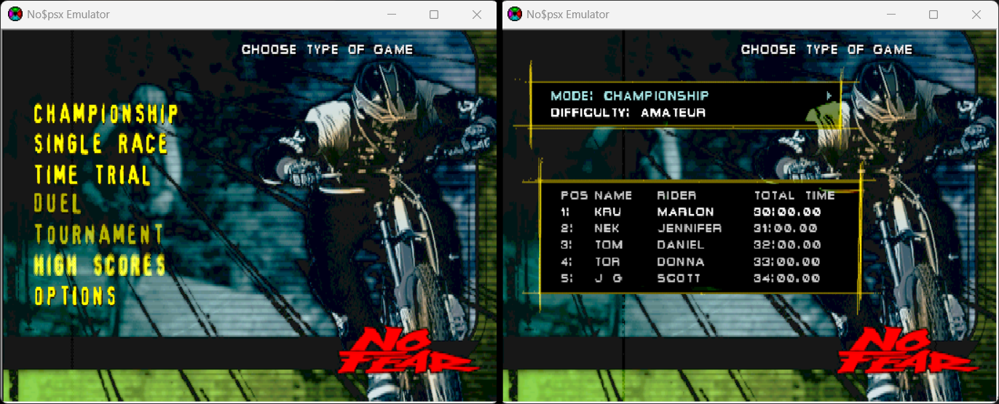 

It's good to also explore more areas of the game to locate additional attack vectors. This leaves more opportunity for exploitation, in case a targeted vector isn't vulnerable.  
The **`"Championship"`** mode functions as the game's campaign mode. Starting a new game allows the user to create a player name with up to three suffix letters. This is another possible candidate to test for an overflow.  

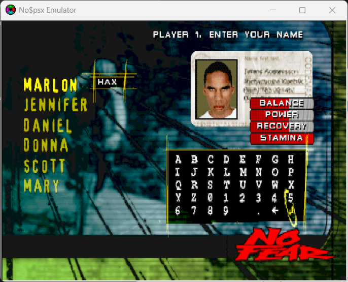

Let's focus on the **`"High Scores"`** being our main attack surface for this article. Be sure to save the data (in-game) before closing the emulator. **`(OPTIONS → MEMORY CARD → SAVE DATA)`**  
I used [MemcardRex](https://github.com/ShendoXT/memcardrex) to export the game's save from no$psx's memory card file **`.mcd`**. After that, I used HxD to examine and make edits to the exported save file.  
Looking through the save, I was able to locate strings relative to the placeholder names rendered in the high score menu. From here, I want to use a very large name and examine how the game reacts. I'll fill a section of the save with **`0xAA`**.  

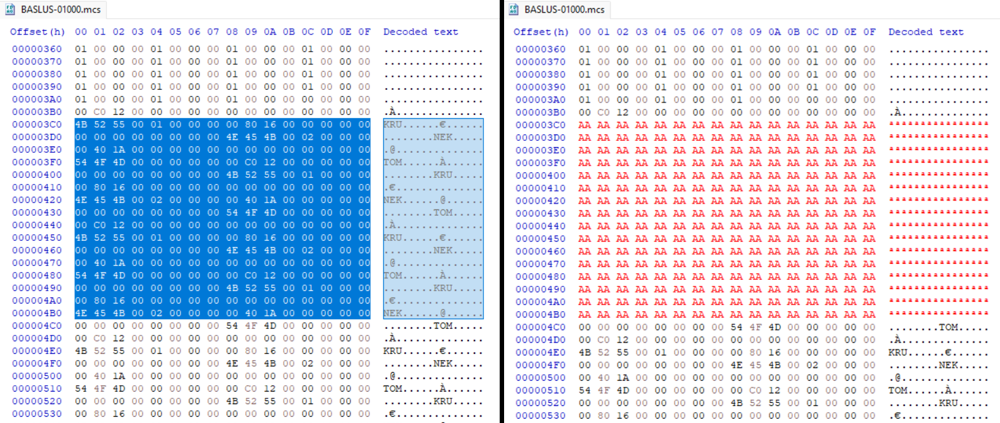 

Once the file is saved, I reimported the data back into MemcardRex and saved the memory card data to no$psx's **`.mcd`** file.  
Upon loading our modified save in-game, **`(OPTIONS → MEMORY CARD → LOAD DATA)`**, we'll navigate back to the **`"High Scores"`** menu and press right.  
The game has crashed, no$psx displays an exception warning, and the debugging windows prioritize in front of the game's screen.  

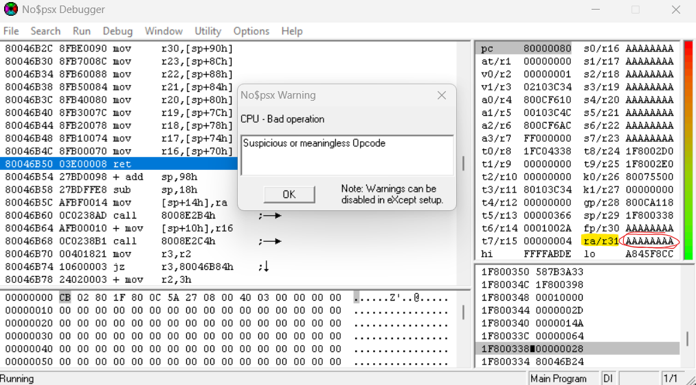 

Looking to the right of the debugger console, you'll quickly notice that the large string we crafted earlier overwrites some stack registers. More importantly, the **`$ra`** register (known as the return address) has also been overwritten. We have a stack smash!  

# Regarding checksums:
It's worth mentioning that some PS1 games may use checksums. They're used to check whether data is valid, modified, or corrupted. Luckily, the game we're researching doesn't use any checksums, allow us to make edits to save files freely.  
Commonly they consist of 2 or 4 bytes in length stored in the save file. There might be more than one instance of a checksum. Creating mulitple unique save files can help determine whether or not a game uses more than one checksum.  
Patching them requires understanding its algorithm and how it validates the save. Disassembling the game's code is often recommended if you want to patch the checksum.  
<ins>This article will not go over patching checksums.</ins>  

# Refining the overflow:
We have confirmed that using a very large string as our name for the high scores not only crashed the game, but also overwrites multiple stack registers including the **`$ra`**.  
At this point, it's good to determine where and when the **`$ra`** gets overwritten in our string so that it can be reliably controlled. We do this by refining our overflow until the **`$ra`** no longer jumps to **`0xAAAAAAAA`**.  
A method I personally use when refining a overflow involves creating a unique pattern for the string. This makes it possible to help decipher which bytes in the pattern overwrite **`$ra`**.  

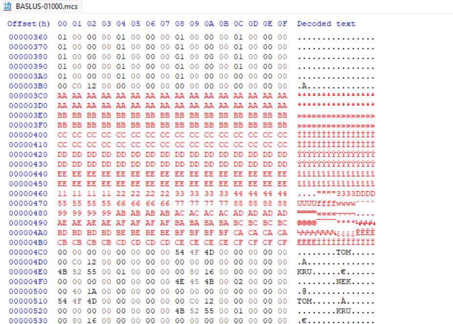 

After loading the modified save back into no$psx and triggering the crash, the stack register **`$ra`** points to an address that resembles a few bytes from the pattern created earlier, specifically pointing to **`0x22222211`**. We now know the exact bytes from the pattern overwrites **`$ra`**.  

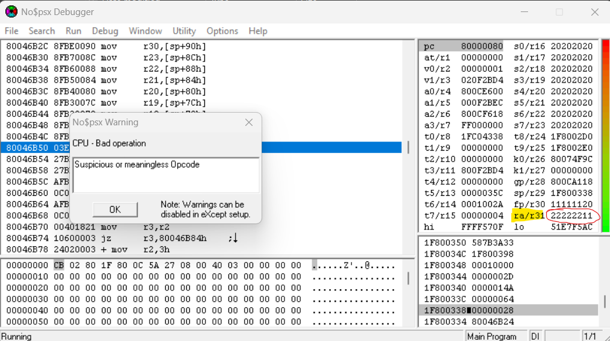 

Let's head back into HxD and replace **`11 22 22 22`** to something more refined. I chose **`58 58 58 58`** as the placeholder. It's also not a bad idea to clean up the string. I decided to replace the previously crafted pattern with **`0x20`**.  

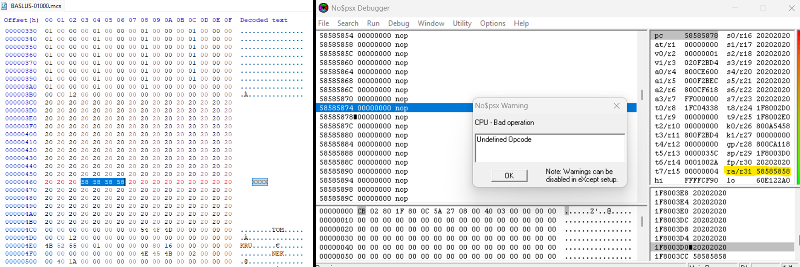 

Then I reimport the save and trigger the crash. It looks like **`$ra`** points to **`0x58585858`**. We now have precise control.  

# Defining our Return Address:
From here, we can point **`$ra`** to any address we chose. It's typically used to jump at a location where you want execute custom code. To find an ideal location, a memory dump is needed.  
no$psx provides the ability to inspect and dump current memory. When dumping memory, you want to do so after the game crashes. This ensures our overflow string is still present in RAM.  
The PS1's memory mapping typically starts at **`0x80000000`**. Click into the memory window located at the lower left of the screen. Press **'G'** to jump to a specific memory address. Enter **`0x80000000`** as your input.  

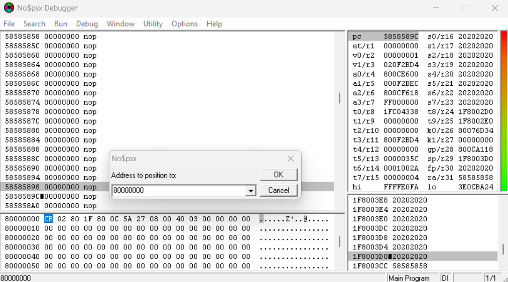 

To dump memory, head into the **`Options`** tab, then click **`Utility → Binarydump to .bin file`**. Enter **`0x200000`** as your size and pick a location on your desktop to save your memory dump.  
Opening the memory dump in HxD, we'll use the application's search feature to locate your string. Once found, you can look for an area to place your payload. I chose a location one row below where the **`$ra`** is controlled. I chose the offset **`0xD17FC`** from the memory dump.  

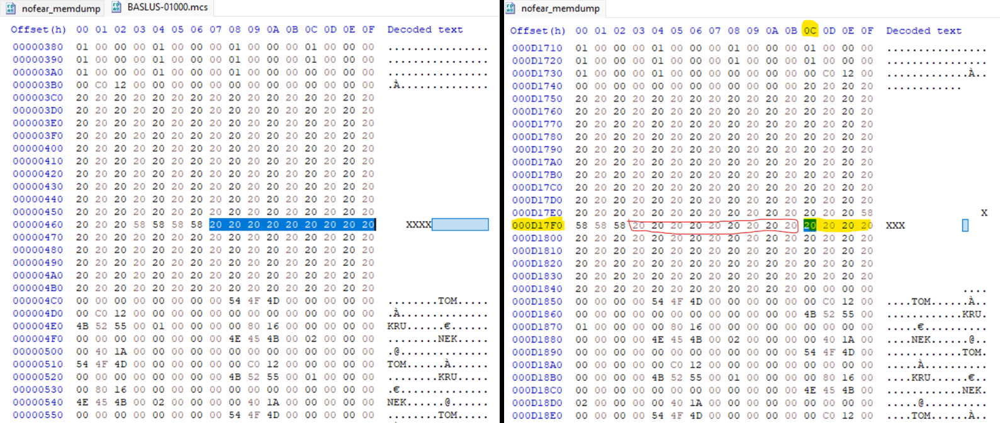 

As mentioned, PS1's memory mapping starts at **`0x80000000`**. In order to jump to the right address in memory, we have to add the starting address to our offset **`0xD17FC`** from the memory dump.


0x80000000 + 0xD17FC = 0x800D17FC


We can now replace the bytes of the placeholder **`$ra`** with **`FC 17 0D 80`**. We're writing the bytes of the address backwards due to the PS1's CPU; it's [little-endian](https://en.wikipedia.org/wiki/Endianness). I also replaced the rest of the padding **`0x20`** bytes with **`0xAA`**. That way we can confirm our bytes are present and executing in memory.  

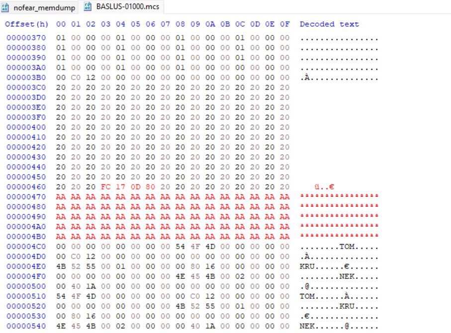 

After reimporting the save, then triggering the crash, you'll see that **`$ra`** points to **`0x800D17FC`**. Looking at the memory viewer from **`$ra`**, you'll see that the **`0xAA`** bytes, we placed as our addition padding, are present in memory. We have successfully redirected the execution flow to our custom code.  

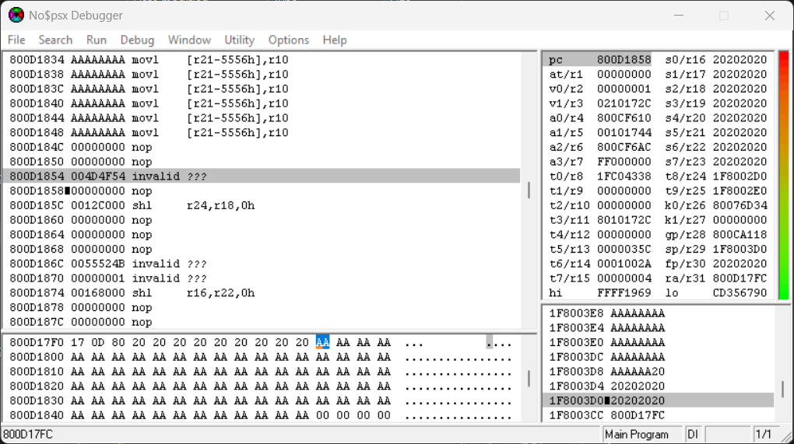 

From here, you can implement the [tonyhax](https://github.com/socram8888/tonyhax) payload into your exploit!  

 

# Conclusion:
In this article, I demonstrated a workflow for discovering and exploiting stack smash vulnerabilities for the PS1. We went over picking a target by finding user-controlled inputs to leverage, causing a crash with an attempted overflow, perfecting the overflow to control the return address, and finally showing how execution flow can be redirected into our own code.  
This workflow can be used on more than one game. The fact that the PS1 has a straightforward design with minimal security mitigations, makes it a well worth platform to start learning about console exploitation.  
That is all for this post, happy hunting!  

# Credits:
[@AcidSnakeDev](https://twitter.com/AcidSnakeDev), [@freakler94](https://twitter.com/freakler94), [@qwikrazor87](https://twitter.com/qwikrazor87) - General inspiration for developing PS1 exploits 
[@socram8888](https://github.com/socram8888) - Tonyhax (payload implementation) 
[nocash](https://problemkaputt.de/) - no$psx & PS1 documentation

